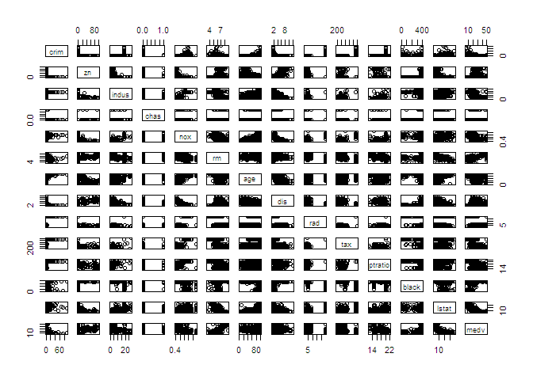
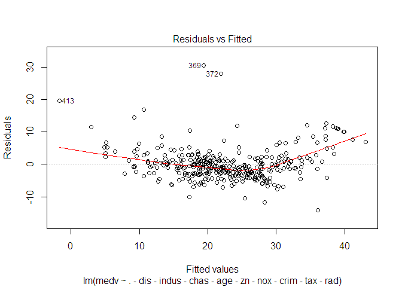
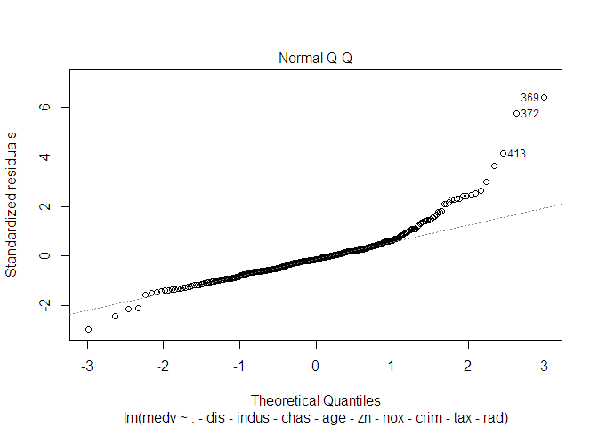
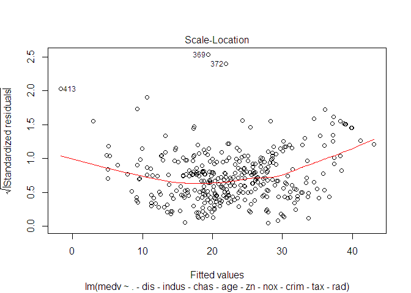
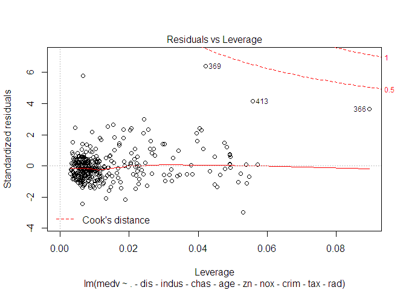
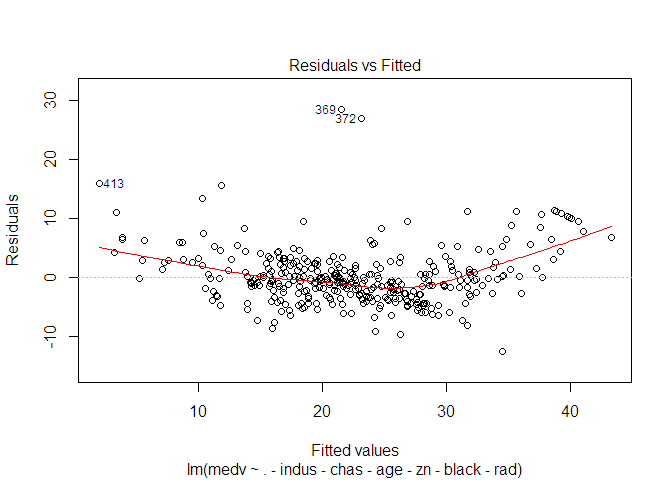
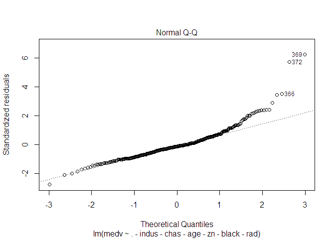
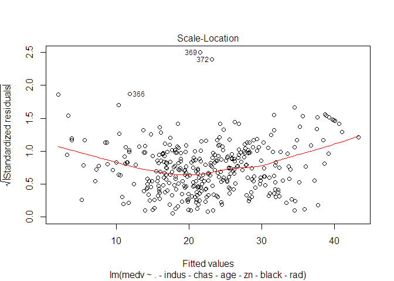
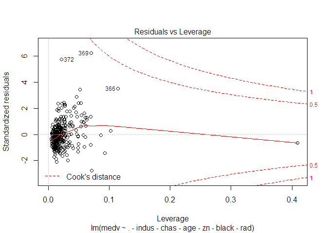
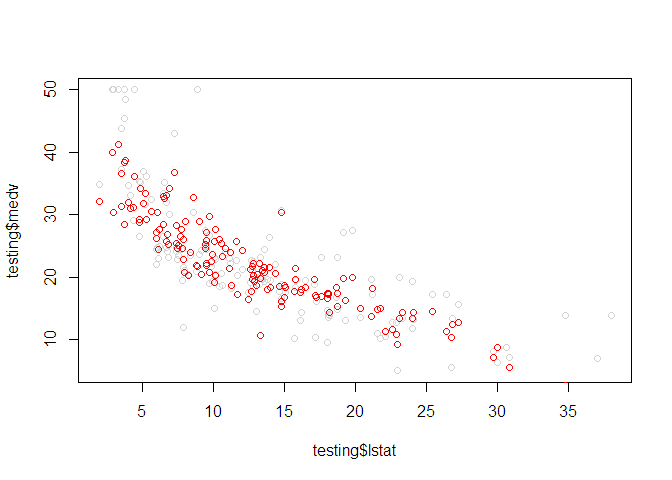

Detecting multicollinearity and selection of significant variables is an
important preparation task in prediction model generation. There are
different technics to manage this task, here are my study notes on this
topic.

I will use Boston data set in R to demonstrate these technics.

    data("Boston")
    boston <- as.data.frame(Boston)
    str(boston)

    ## 'data.frame':    506 obs. of  14 variables:
    ##  $ crim   : num  0.00632 0.02731 0.02729 0.03237 0.06905 ...
    ##  $ zn     : num  18 0 0 0 0 0 12.5 12.5 12.5 12.5 ...
    ##  $ indus  : num  2.31 7.07 7.07 2.18 2.18 2.18 7.87 7.87 7.87 7.87 ...
    ##  $ chas   : int  0 0 0 0 0 0 0 0 0 0 ...
    ##  $ nox    : num  0.538 0.469 0.469 0.458 0.458 0.458 0.524 0.524 0.524 0.524 ...
    ##  $ rm     : num  6.58 6.42 7.18 7 7.15 ...
    ##  $ age    : num  65.2 78.9 61.1 45.8 54.2 58.7 66.6 96.1 100 85.9 ...
    ##  $ dis    : num  4.09 4.97 4.97 6.06 6.06 ...
    ##  $ rad    : int  1 2 2 3 3 3 5 5 5 5 ...
    ##  $ tax    : num  296 242 242 222 222 222 311 311 311 311 ...
    ##  $ ptratio: num  15.3 17.8 17.8 18.7 18.7 18.7 15.2 15.2 15.2 15.2 ...
    ##  $ black  : num  397 397 393 395 397 ...
    ##  $ lstat  : num  4.98 9.14 4.03 2.94 5.33 ...
    ##  $ medv   : num  24 21.6 34.7 33.4 36.2 28.7 22.9 27.1 16.5 18.9 ...

Boston data contains 1978's housing information in Boston. You can
simply type ?boston to see the details. I will try to estimate the
housing prices using the predictors. Medv variable is the corresponding
median value of the housing prices(in $1000s) and the other variables
are the predictors.

First thing generally we need to do is to create the training and
testing sets.

    set.seed(1234)
    inTrain <- createDataPartition(y=boston$medv,p=0.7, list=FALSE)
    training <- boston[inTrain,]
    testing <- boston[-inTrain,]
    dim(testing);dim(training)

    ## [1] 150  14

    ## [1] 356  14

Detecting multicollinearity
---------------------------

If your data does not have too many dimension following command simply
gives a general look of your data and you can shortly see what's going
on in general.

    plot(boston)

The plot of pairs shows that there are some trends in data and this
gives an idea of prediction may work well but i do not go into how to
interpret plots now. Instead, we can make the correlation matrix of the
data which makes it easier.

    # Make a matrix of correlations of all predictors
    M <- abs(cor(training[,-14]))

    # Set the diagonal to zero (the correlation of a predictor with itself, it's 1, we know, so we should remove it)
    diag(M) <- 0

    # Find the parameters having correlation over a threshold.
    which(M > 0.7,arr.ind=T)

    ##       row col
    ## nox     5   3
    ## dis     8   3
    ## tax    10   3
    ## indus   3   5
    ## age     7   5
    ## dis     8   5
    ## nox     5   7
    ## dis     8   7
    ## indus   3   8
    ## nox     5   8
    ## age     7   8
    ## tax    10   9
    ## indus   3  10
    ## rad     9  10

Some variables seems to have multicollinearity, we may manually remove
them when building the model but since i would like to demonstrate some
technics for feature selection i will not do that.

Eigen system analysis is a technic which is not only pairwise but also
has more complicated analysis. When the values are close, we can say
that multi-collinearity does not exist. But vice versa, like in this
data, there should be a problem.

    eigen(cor(training))$values

    ##  [1] 6.53779955 1.67117293 1.38710353 0.95993427 0.85284117 0.64903850
    ##  [7] 0.47742824 0.40464360 0.25564310 0.22947201 0.20946720 0.17785106
    ## [13] 0.13408959 0.05351526

    # Condition Number: Ratio of max to min Eigen values of the correlation matrix
    max(eigen(cor(training))$values)/min(eigen(cor(training))$values)

    ## [1] 122.167

    kappa(cor(training), exact = TRUE)

    ## [1] 122.167

Exploratory analysis
--------------------

Intuitionally we may know that crime ratio is an important effect

    plot_ly(training, x = ~crim, y = ~medv, color = ~crim,
            size = ~crim, text = ~paste("Zn: ", zn),type = "scatter", mode="markers" )

<!--html_preserve-->

<!--/html_preserve-->
Graph shows that crime ratio has a trend with housing prices as
expected.

The same visualization can be made for other features as well.

    plot_ly(training, x = ~indus, y = ~medv, color = ~indus,
            size = ~indus, text = ~paste("Zn: ", zn),type = "scatter", mode="markers" )

<!--html_preserve-->

<!--/html_preserve-->
    plot_ly(training, x = ~chas, y = ~medv,type = "box")

<!--html_preserve-->

<!--/html_preserve-->
How about checking the variables which are found having collinearity?
E.g. nox with crim.

    plot_ly(training, x = ~nox, y = ~medv, color = ~nox,
             size = ~nox, text = ~paste("Zn: ", zn),type = "scatter", mode="markers" )

<!--html_preserve-->

<!--/html_preserve-->
Similar trend with medv exists in nox and crim features. Let's move
ahead.

Which features should we remove
-------------------------------

Variance inflation factor is a technic that can be used for feature
selection.

    model = lm(medv~., data = training)
    vif(model)

    ##      crim        zn     indus      chas       nox        rm       age 
    ##  2.128848  2.387983  4.084376  1.076718  4.359516  1.870169  3.305758 
    ##       dis       rad       tax   ptratio     black     lstat 
    ##  4.120336  8.443791 10.152816  1.812406  1.405746  2.929285

By using vif values and feature significancy in the model, feature are
eliminated to reduce variance inflation and to have the significant
features in the model.

The following model seems to fit good according to this method.

    model = lm(medv~.-dis-indus-chas-age-zn-nox-crim-tax-rad, data = training)
    summary(model)

    ## 
    ## Call:
    ## lm(formula = medv ~ . - dis - indus - chas - age - zn - nox - 
    ##     crim - tax - rad, data = training)
    ## 
    ## Residuals:
    ##     Min      1Q  Median      3Q     Max 
    ## -14.142  -2.856  -0.662   1.682  30.585 
    ## 
    ## Coefficients:
    ##              Estimate Std. Error t value Pr(>|t|)    
    ## (Intercept) 13.319134   4.664624   2.855  0.00455 ** 
    ## rm           4.694079   0.466507  10.062  < 2e-16 ***
    ## ptratio     -0.960232   0.128464  -7.475 6.23e-13 ***
    ## black        0.010218   0.003229   3.165  0.00169 ** 
    ## lstat       -0.513637   0.051092 -10.053  < 2e-16 ***
    ## ---
    ## Signif. codes:  0 '***' 0.001 '**' 0.01 '*' 0.05 '.' 0.1 ' ' 1
    ## 
    ## Residual standard error: 4.876 on 351 degrees of freedom
    ## Multiple R-squared:  0.7104, Adjusted R-squared:  0.7071 
    ## F-statistic: 215.2 on 4 and 351 DF,  p-value: < 2.2e-16

    vif(model)

    ##       rm  ptratio    black    lstat 
    ## 1.626664 1.196178 1.210080 1.900563

    pred <- predict(model, testing)

The following plot shows testing values against predictions. The trend
looks linear, so we can say model made OK. But there are some outliers,
which means that there is some variance which is not be able to
explained by the model. The study

    plot_ly(testing, x = pred, y = ~medv,type = "scatter",mode="markers")

<!--html_preserve-->

<!--/html_preserve-->
    plot(model)

So we should better include some other variables, but which?

The earth package implements variable importance based on Generalized
cross validation (GCV), number of subset models the variable occurs
(nsubsets) and residual sum of squares (RSS). I tried this method on the
data as follows:

    marsModel <- earth(medv~., data=training)
    ev <- evimp (marsModel,trim = FALSE)
    ev

    ##             nsubsets   gcv    rss
    ## rm                19 100.0  100.0
    ## lstat             18  62.2   63.4
    ## ptratio           16  31.5   34.8
    ## nox               15  27.6   31.1
    ## dis               14  26.9   30.1
    ## crim              11  19.8   23.2
    ## tax                9  14.4   18.3
    ## rad                7  10.8   14.8
    ## black              5   4.8   10.2
    ## indus              3   4.0    8.0
    ## zn-unused          0   0.0    0.0
    ## chas-unused        0   0.0    0.0
    ## age-unused         0   0.0    0.0

Our model has rm, ptratio, black and lstat. So we correctly select the
first 3 features. black is also in the features Earth package finds as
significant but there are more important features. So let's update the
model according to this.

    model = lm(medv~.-indus-chas-age-zn-black-rad, data = training)
    summary(model)

    ## 
    ## Call:
    ## lm(formula = medv ~ . - indus - chas - age - zn - black - rad, 
    ##     data = training)
    ## 
    ## Residuals:
    ##      Min       1Q   Median       3Q      Max 
    ## -12.6172  -2.8600  -0.5911   2.0034  28.4226 
    ## 
    ## Coefficients:
    ##               Estimate Std. Error t value Pr(>|t|)    
    ## (Intercept)  3.482e+01  5.370e+00   6.485 3.04e-10 ***
    ## crim        -4.968e-02  4.773e-02  -1.041 0.298595    
    ## nox         -1.484e+01  4.057e+00  -3.658 0.000293 ***
    ## rm           4.180e+00  4.557e-01   9.173  < 2e-16 ***
    ## dis         -1.068e+00  1.855e-01  -5.760 1.85e-08 ***
    ## tax         -9.173e-04  2.535e-03  -0.362 0.717681    
    ## ptratio     -1.016e+00  1.400e-01  -7.259 2.57e-12 ***
    ## lstat       -5.688e-01  5.652e-02 -10.062  < 2e-16 ***
    ## ---
    ## Signif. codes:  0 '***' 0.001 '**' 0.01 '*' 0.05 '.' 0.1 ' ' 1
    ## 
    ## Residual standard error: 4.727 on 348 degrees of freedom
    ## Multiple R-squared:  0.7301, Adjusted R-squared:  0.7247 
    ## F-statistic: 134.5 on 7 and 348 DF,  p-value: < 2.2e-16

    vif(model)

    ##     crim      nox       rm      dis      tax  ptratio    lstat 
    ## 1.819539 3.666052 1.651545 2.537302 2.815370 1.510923 2.474887

    pred <- predict(model, testing)

After adding the features the model slightly performs better. Rsquared
increased to 73% from 71% and residual standart error decreased to 4.7
from 4.8. It is another decision to have a slightly better model but
with a few extra terms. Sometimes simplicity may be more important than
accuracy.

    plot_ly(testing, x = pred, y = ~medv,type = "scatter",mode="markers")

<!--html_preserve-->

<!--/html_preserve-->
    plot(model)

The following plot shows real values vs. predictions. Real values are
light gray and as you can see some values are quite far from the trend
and this is probably because of unexplained variations in the data.
Perhaps there are some other factors(not in data) effecting the house
prices and we have no information about them.

    plot(testing$lstat,testing$medv, col="lightgrey")
    points(testing$lstat,pred,col="red")

